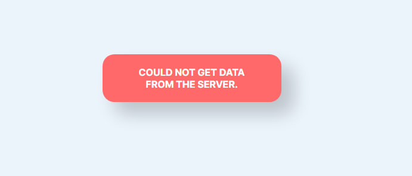

## Домашнее задание 3: API, DTO, мапперы и `useReducer`

### Цель
Перевести конвертер с локальных моков на данные из API, организовать согласованную загрузку данных через `useReducer` и отделить серверный контракт от клиентских моделей через DTO и мапперы.

### Что нужно реализовать
#### Техническая часть и бизнес-логика:
1. Получать список валют и курсам с API, а не из локальных моков.
2. Завести отдельные TypeScript-типы для DTO:
   - `CurrencyDto`;
   - `PriceChangeDto`.
3. Реализовать мапперы:
   - `CurrencyDto -> Currency`;
   - `PriceChangeDto -> PriceChange`.
4. Организовать загрузку данных через `useEffect` и `useReducer`.
5. В `reducer` согласованно хранить и обновлять состояние загрузки:
   - статус загрузки (достаточно булинового типа для UI);
   - полученные данные;
   - ошибку загрузки;
   - выбранную пару валют, если это состояние вы тоже переводите в `reducer`.
6. Реализовать безопасную обработку ошибок API. Если запрос завершился ошибкой, приложение не падает;

#### Дополнительное задание (необязательно, но кто сделает, может считать себя крутым):
1. Добавить debounce для запросов при вводе данных.

#### UI
1. Если в течении загрузки сервер выкинул ошибку (например в кейсе, если сервер не включён и запрос не прошёл), то показываем пользователю, что проблема на стороне сервера. Пример: 
2. Если сервер упал/выкинул ошибку входе работы с приложением(при вводе количества валюты для перевода), показывать ошибку виде toast сверху приложения.
4. Реализовать контроллируемое/неконтроллируемое поле ввода валюты.

### Источник данных
Данные нужно получать не из моков, а из локального backend-приложения в папке `server`.

### Как работать с backend из папки `server`
Backend написан на ASP.NET Core и лежит в папке `server`.

Как запустить:
1. Убедиться, что установлен `.NET 8 SDK`.
2. Открыть терминал в папке `server`.
3. Выполнить команду в консоли `dotnet run` из папки `server`.
4. После запуска backend будет доступен по адресу `http://localhost:5081`, а Swagger - по адресу `http://localhost:5081/swagger` (адреса могут быть другоими, посмотрите корректный адрес в консоли).

Основные эндпоинты:
- `GET /Currency` - получить список валют;
- `GET /Currency/{code}` - получить одну валюту по коду;
- `GET /prices?paymentCurrency=XXX&purchasedCurrency=YYY&fromDateTime=...&toDateTime=...` - получить историю курсов для пары валют. Все параметры обязательные, кроме `toDateTime`.

Ответ `GET /prices` приходит в виде массива изменений курса:
```json
[
  {
    "purchasedCurrencyCode": "JPY", 
    "paymentCurrencyCode": "CAD",
    "price": 0.741, 
    "dateTime": "2026-05-21T03:40:54.2709677Z"
  }
]
```

Поля ответа:
- `purchasedCurrencyCode` - код валюты, которую покупаем;
- `paymentCurrencyCode` - код валюты, которой платим;
- `price` - курс для выбранной пары валют на конкретный момент времени;
- `dateTime` - время, к которому относится значение курса.

Пока что для расчета конвертации достаточно брать последний элемент из возвращаемого массива и использовать его поле `price` как актуальный курс.

Как использовать в клиенте:
1. При инициализации приложения загрузить список валют через `GET /Currency`.
2. Для выбранной пары валют запрашивать курсы через `GET /prices`.
3. Для расчета конвертации использовать актуальную запись из полученной истории курсов.
4. Получение данных обернуть в `useReducer`, чтобы состояния загрузки, успеха и ошибки обновлялись согласованно.
5. Если запрос завершился ошибкой, показать пользователю безопасный fallback: сообщение об ошибке, состояние загрузки или пустой результат без падения приложения.

### Тесты
Минимальный набор тестов:
- unit-тесты на мапперы `CurrencyDto -> Currency` и `PriceChangeDto -> PriceChange`;
- unit-тесты на `reducer`:
  - переход в состояние загрузки;
  - успешная запись данных;
  - корректная запись ошибки;
- тест на корректное отображение loading/error/success-состояний в UI;

### Ограничения
- Не использовать библиотеки автогенерации мапперов.
- Не смешивать DTO и клиентские модели в одном типе.

### Критерии приемки
- Приложение получает данные из backend;
- Запросы к API вынесены в отдельный слой;
- DTO типизированы отдельно от клиентских моделей;
- Данные из API проходят через явные мапперы до попадания в UI;
- Состояния `loading`, `data` и `error` управляются через `useReducer` и обновляются согласованно;
- Приложение не падает при ошибках API и корректно показывает состояние ошибки;
- Структура проекта остается понятной и разделенной по ответственности;
- Тесты проходят через `npm run test`.

### Что сдаем
- Ссылку на репозиторий.
- Код третьего этапа.
